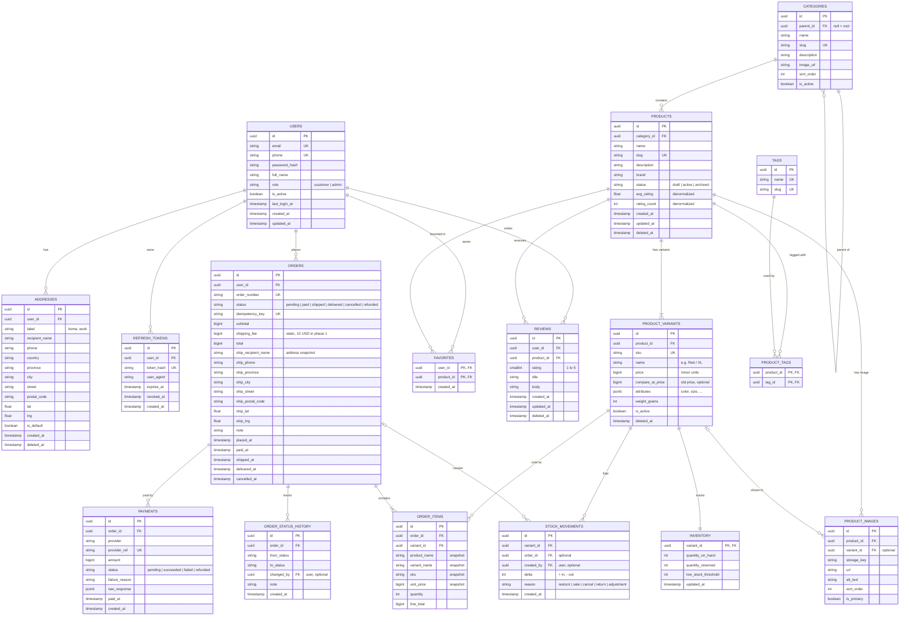

# Dakeh Database Schema

Entity-relationship diagram (rendered automatically by GitHub). Money is stored as integer cents in USD. The cart lives in Redis and is not part of this diagram.

```mermaid
erDiagram
    USERS ||--o{ ADDRESSES : has
    USERS ||--o{ REFRESH_TOKENS : owns
    USERS ||--o{ ORDERS : places
    USERS ||--o{ FAVORITES : saves
    USERS ||--o{ REVIEWS : writes
    CATEGORIES ||--o{ CATEGORIES : "parent of"
    CATEGORIES ||--o{ PRODUCTS : contains
    PRODUCTS ||--|{ PRODUCT_VARIANTS : "has variants"
    PRODUCTS ||--o{ PRODUCT_IMAGES : "has image"
    PRODUCT_VARIANTS |o--o{ PRODUCT_IMAGES : "shown in"
    PRODUCTS ||--o{ PRODUCT_TAGS : "tagged with"
    TAGS ||--o{ PRODUCT_TAGS : "used by"
    PRODUCT_VARIANTS ||--|| INVENTORY : tracks
    PRODUCT_VARIANTS ||--o{ STOCK_MOVEMENTS : logs
    PRODUCT_VARIANTS ||--o{ ORDER_ITEMS : "sold as"
    PRODUCTS ||--o{ FAVORITES : "favorited in"
    PRODUCTS ||--o{ REVIEWS : receives
    ORDERS ||--|{ ORDER_ITEMS : contains
    ORDERS ||--o{ PAYMENTS : "paid by"
    ORDERS ||--o{ ORDER_STATUS_HISTORY : tracks
    ORDERS |o--o{ STOCK_MOVEMENTS : causes

    USERS {
        uuid id PK
        string email UK
        string phone UK
        string password_hash
        string full_name
        string role "customer | admin"
        boolean is_active
        timestamp last_login_at
        timestamp created_at
        timestamp updated_at
    }

    REFRESH_TOKENS {
        uuid id PK
        uuid user_id FK
        string token_hash UK
        string user_agent
        timestamp expires_at
        timestamp revoked_at
        timestamp created_at
    }

    ADDRESSES {
        uuid id PK
        uuid user_id FK
        string label "home, work"
        string recipient_name
        string phone
        string country
        string province
        string city
        string street
        string postal_code
        float lat
        float lng
        boolean is_default
        timestamp created_at
        timestamp deleted_at
    }

    CATEGORIES {
        uuid id PK
        uuid parent_id FK "null = root"
        string name
        string slug UK
        string description
        string image_url
        int sort_order
        boolean is_active
    }

    TAGS {
        uuid id PK
        string name UK
        string slug UK
    }

    PRODUCTS {
        uuid id PK
        uuid category_id FK
        string name
        string slug UK
        string description
        string brand
        string status "draft | active | archived"
        float avg_rating "denormalized"
        int rating_count "denormalized"
        timestamp created_at
        timestamp updated_at
        timestamp deleted_at
    }

    PRODUCT_TAGS {
        uuid product_id "PK, FK"
        uuid tag_id "PK, FK"
    }

    PRODUCT_VARIANTS {
        uuid id PK
        uuid product_id FK
        string sku UK
        string name "e.g. Red / XL"
        bigint price "minor units"
        bigint compare_at_price "old price, optional"
        jsonb attributes "color, size, ..."
        int weight_grams
        boolean is_active
        timestamp deleted_at
    }

    PRODUCT_IMAGES {
        uuid id PK
        uuid product_id FK
        uuid variant_id FK "optional"
        string storage_key
        string url
        string alt_text
        int sort_order
        boolean is_primary
    }

    INVENTORY {
        uuid variant_id "PK, FK"
        int quantity_on_hand
        int quantity_reserved
        int low_stock_threshold
        timestamp updated_at
    }

    STOCK_MOVEMENTS {
        uuid id PK
        uuid variant_id FK
        uuid order_id FK "optional"
        uuid created_by FK "user, optional"
        int delta "+ in, - out"
        string reason "restock | sale | cancel | return | adjustment"
        timestamp created_at
    }

    FAVORITES {
        uuid user_id "PK, FK"
        uuid product_id "PK, FK"
        timestamp created_at
    }

    REVIEWS {
        uuid id PK
        uuid user_id FK
        uuid product_id FK
        smallint rating "1 to 5"
        string title
        string body
        timestamp created_at
        timestamp updated_at
        timestamp deleted_at
    }

    ORDERS {
        uuid id PK
        uuid user_id FK
        string order_number UK
        string status "pending | paid | shipped | delivered | cancelled | refunded"
        string idempotency_key UK
        bigint subtotal
        bigint shipping_fee "static, 10 USD in phase 1"
        bigint total
        string ship_recipient_name "address snapshot"
        string ship_phone
        string ship_province
        string ship_city
        string ship_street
        string ship_postal_code
        float ship_lat
        float ship_lng
        string note
        timestamp placed_at
        timestamp paid_at
        timestamp shipped_at
        timestamp delivered_at
        timestamp cancelled_at
    }

    ORDER_ITEMS {
        uuid id PK
        uuid order_id FK
        uuid variant_id FK
        string product_name "snapshot"
        string variant_name "snapshot"
        string sku "snapshot"
        bigint unit_price "snapshot"
        int quantity
        bigint line_total
    }

    ORDER_STATUS_HISTORY {
        uuid id PK
        uuid order_id FK
        string from_status
        string to_status
        uuid changed_by FK "user, optional"
        string note
        timestamp created_at
    }

    PAYMENTS {
        uuid id PK
        uuid order_id FK
        string provider
        string provider_ref UK
        bigint amount
        string status "pending | succeeded | failed | refunded"
        string failure_reason
        jsonb raw_response
        timestamp paid_at
        timestamp created_at
    }
```
